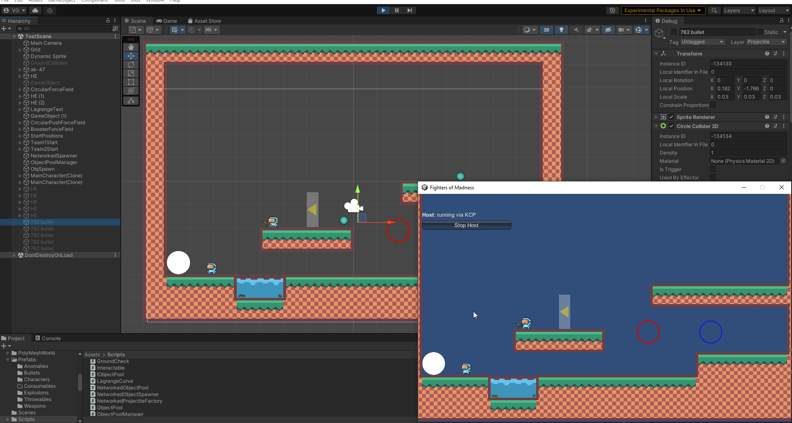
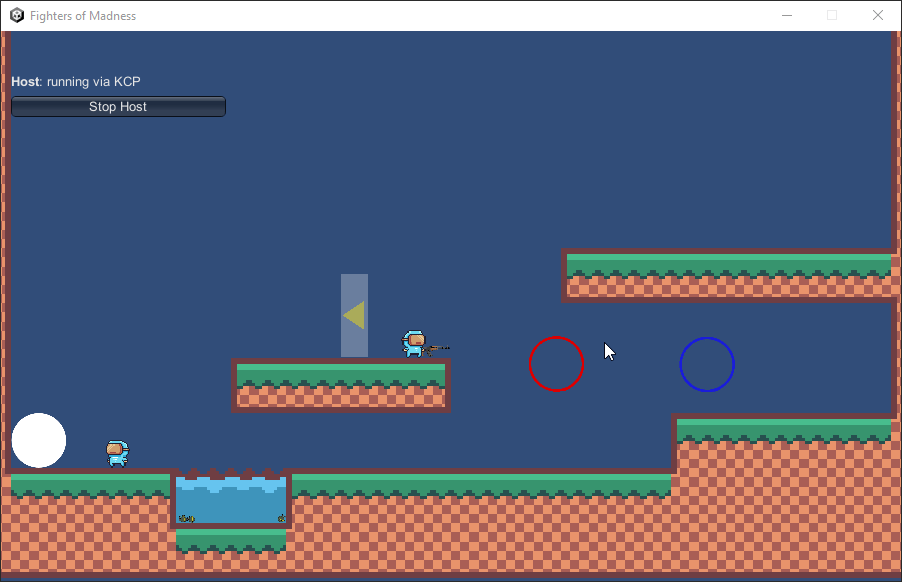

# Unity multiplayer demo project scripts

This is my first Unity project after the "Hello World!" projects. The part of the main concept is that players can fight with each other with the selected characters in a 2D platformer world. You can fight over your next weapon which will may or may not give you advantage. To spice up the gameplay the game includes throwable objects like HE grenades.

### Todos:

 High priority:
 - Modular movement system
 - Extending the respective projectile pool on spawning new weapon entity
 - Move held weapon position simulation responsibility from client to server

Moderate priority:
 - Migrate input system to the newer Unity API 
 - Implement Initialize methods in every Poolable Object
 - Add double jump and aerial jump movement actions (Preferably after the movement system refactor)

Low priority:
 - Add various weapons, throwables, characters etc.
 - Loading screen before everyone loaded in the gameplay scene
 - Add stun and root effects
 - Damage system

### Demo gifs

#### Networked Object Pooling demo:

 

#### Force field mechanics:

 

 #### Throwable mechanics:

 - Grenades at first can be fuzed and then thrown
 - A fuzed grenade can be picked up and thrown again
 - If left in hands for too long, it explodes in the characters hand

 