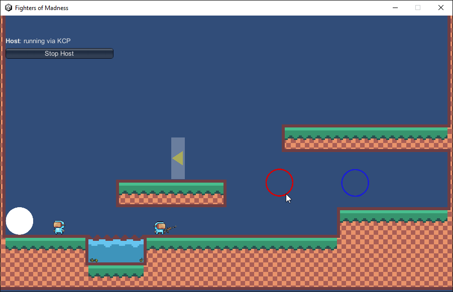

# Unity multiplayer demo project scripts

### Demo gifs

#### Networked Object Pooling demo:

 

#### Force field mechanics:

 

 #### Throwable mechanics:

 - Grenades at first can be fuzed and then thrown
 - A fuzed grenade can be picked up and thrown again
 - If left in hands for too long, it explodes in the characters hand

 